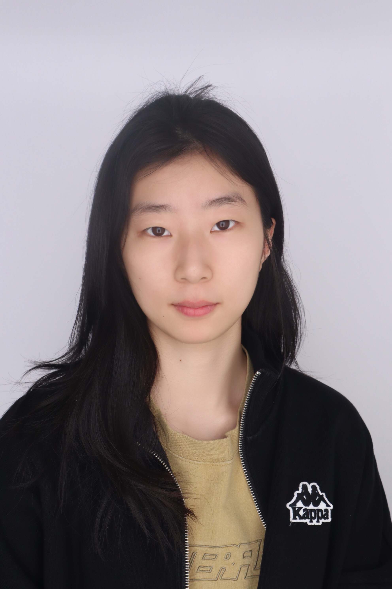

  <!-- Left Column: Intro Text -->
  

I'm a <strong>Data Analyst</strong> and <strong>Computational Researcher</strong> with a passion for using data to drive insights in <strong>neuroimaging</strong>, <strong>biomedical image analysis</strong>, and <strong>machine learning</strong>. With a Master’s in Data Science from Vanderbilt University and over five years of experience, I specialize in building scalable data pipelines, analyzing high-dimensional data, and applying advanced ML techniques to real-world problems.

📍 San Francisco, CA  
 📫 <a href="mailto:lixueyuan33@outlook.com">Email me</a> | <a href="https://www.linkedin.com/in/xueyuan-li-674208249/">LinkedIn</a> | <a href="https://github.com/Xueyuan33">GitHub</a>

  

  <!-- Right Column: Photo + Contact -->
  

    
    <address style="font-style: normal; font-size: 14px;">
      <strong>UCSF Radiology Dept</strong> 
      1700 4th St 
      San Francisco, CA 94158 
      <a href="mailto:lixueyuan33@outlook.com">lixueyuan33@outlook.com</a>
    </address>
  

---

## 🧪 Current Role

**Staff Research Associate II**  
*University of California, San Francisco*  
📍 *San Francisco, CA* | 🗓 *Jan 2025 – Present*

Working in the labs of Dr. Janine Lupo and Dr. Tony Yang, focusing on cutting-edge neuroimaging research. Responsible for collecting, transferring, processing, and analyzing MRI and EEG data from patients to advance understanding in biomedical imaging and develop innovative imaging techniques.

---

## 🎓 Education

**M.S. in Data Science**  
*Vanderbilt University, Nashville, USA*  
🗓 *Aug 2022 – May 2024*  
Relevant Coursework: Python & R, Statistics, Machine Learning, Medical Image Analysis, Database Systems

**B.E. in Data Science and Big Data Technology**  
*Henan University, Henan, China*  
🗓 *Sep 2018 – Jun 2022*  
Relevant Coursework: Data Structures, Java Programming, Big Data Platforms, Algorithms, AI

---

## 🔬 Research Highlights

- **Biomedical Image Analysis (Vanderbilt University HRLB Lab)**
 🗓 *May 2023 – Oct 2024*  
  - Specialized in high-dimensional data analysis and computational pathology, focusing on advancing machine learning and deep learning algorithms for high-resolution biomedical imaging. 
  - Developed the SAM-assisted Molecular-empowered Learning approach, leveraging innovative techniques to improve segmentation accuracy and enhance model robustness in biomedical image analysis.
    [HRLB Lab](https://hrlblab.github.io))

---

## 💻 Technical Skills

- **Languages:** Python, R, SQL, Java, C++  
- **Tools:** Jupyter, RStudio, 3D-Slicer, ITK/VTK  
- **Cloud & Database:** AWS, GCP, MySQL  
- **Specialties:** fMRI & EEG analysis, ML & DL models, image segmentation, pipeline automation

---

## 📈 Selected Projects

- **Investment Portfolio Tracker App** – Full-stack app using React, Node.js, Docker, and AWS  
- **Cloud-Based Airbnb Recommender** – Collaborative filtering with PySpark on GCP  
- **Graph-Based Amazon Product Recommender** – Used GNNs and NetworkX for personalized recommendations  
- **CT Lung Image Segmentation** – Medical imaging pipeline using C++ and ITK/VTK

---

## 📚 Publications

- **Xueyuan Li**, Ruining Deng, Yucheng Tang, Shunxing Bao, Haichun Yang, Yuankai Huo.  
  *Leverage Weakly Annotation to Pixel-wise Annotation via Zero-shot Segment Anything Model for Molecular-empowered Learning*.  
  *SPIE Medical Imaging Conferences, 2024*  
  🏆 Finalist, Robert F. Wagner All-Conference Best Student Paper Award  
  [Read on arXiv](https://arxiv.org/abs/2308.05785v1)

---

Thanks for visiting! Feel free to explore my [GitHub projects](https://github.com/Xueyuan33) or [get in touch](mailto:lixueyuan33@outlook.com).
